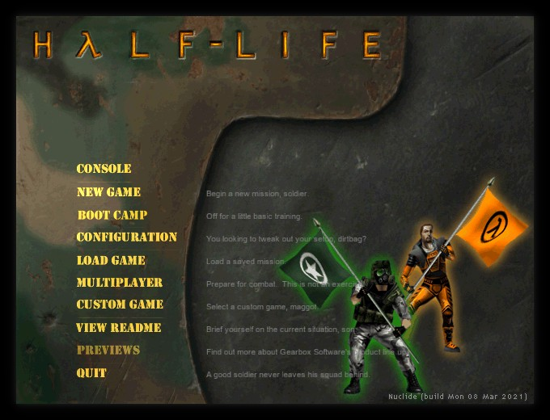
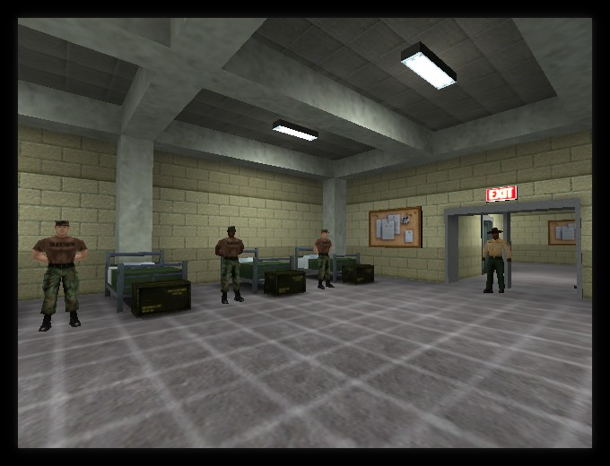
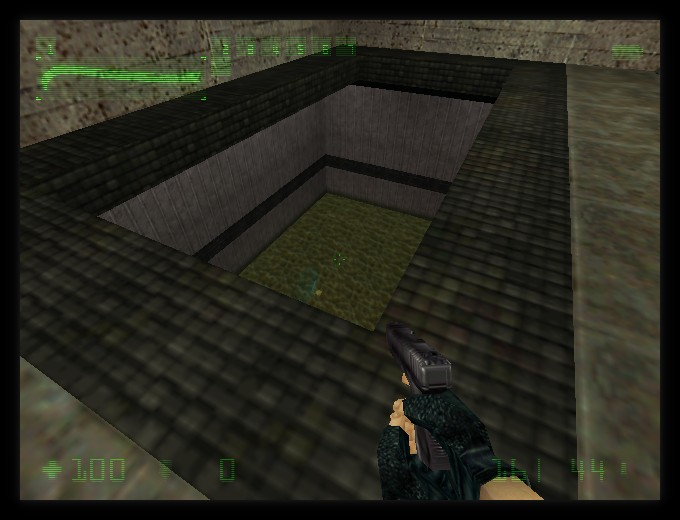
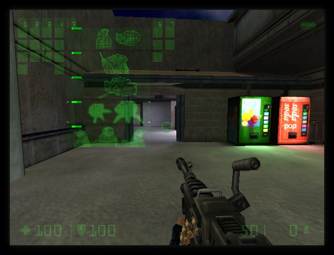

# Rad-Therapy: Boot Camp
Port of Half-Life: Opposing Force (1999) to Nuclide.

## Building

Same steps as for Rad-Therapy. Just pass `GAME=gearbox` instead of `GAME=valve`.

## Community

### Matrix
If you're a fellow Matrix user, join the Nuclide Space to see live-updates and more!
https://matrix.to/#/#nuclide:matrix.org

### IRC
Join us on #freecs via irc.libera.chat and talk/lurk or discuss bugs, issues
and other such things. It's bridged with the Matrix room of the same name!

### Others
We've had people ask in the oddest of places for help, please don't do that.

## License
ISC License

Copyright (c) 2016-2025 Marco "eukara" Cawthorne <marco@icculus.org>

Permission to use, copy, modify, and distribute this software for any
purpose with or without fee is hereby granted, provided that the above
copyright notice and this permission notice appear in all copies.

THE SOFTWARE IS PROVIDED "AS IS" AND THE AUTHOR DISCLAIMS ALL WARRANTIES
WITH REGARD TO THIS SOFTWARE INCLUDING ALL IMPLIED WARRANTIES OF
MERCHANTABILITY AND FITNESS. IN NO EVENT SHALL THE AUTHOR BE LIABLE FOR
ANY SPECIAL, DIRECT, INDIRECT, OR CONSEQUENTIAL DAMAGES OR ANY DAMAGES
WHATSOEVER RESULTING FROM LOSS OF MIND, USE, DATA OR PROFITS, WHETHER
IN AN ACTION OF CONTRACT, NEGLIGENCE OR OTHER TORTIOUS ACTION, ARISING
OUT OF OR IN CONNECTION WITH THE USE OR PERFORMANCE OF THIS SOFTWARE.
